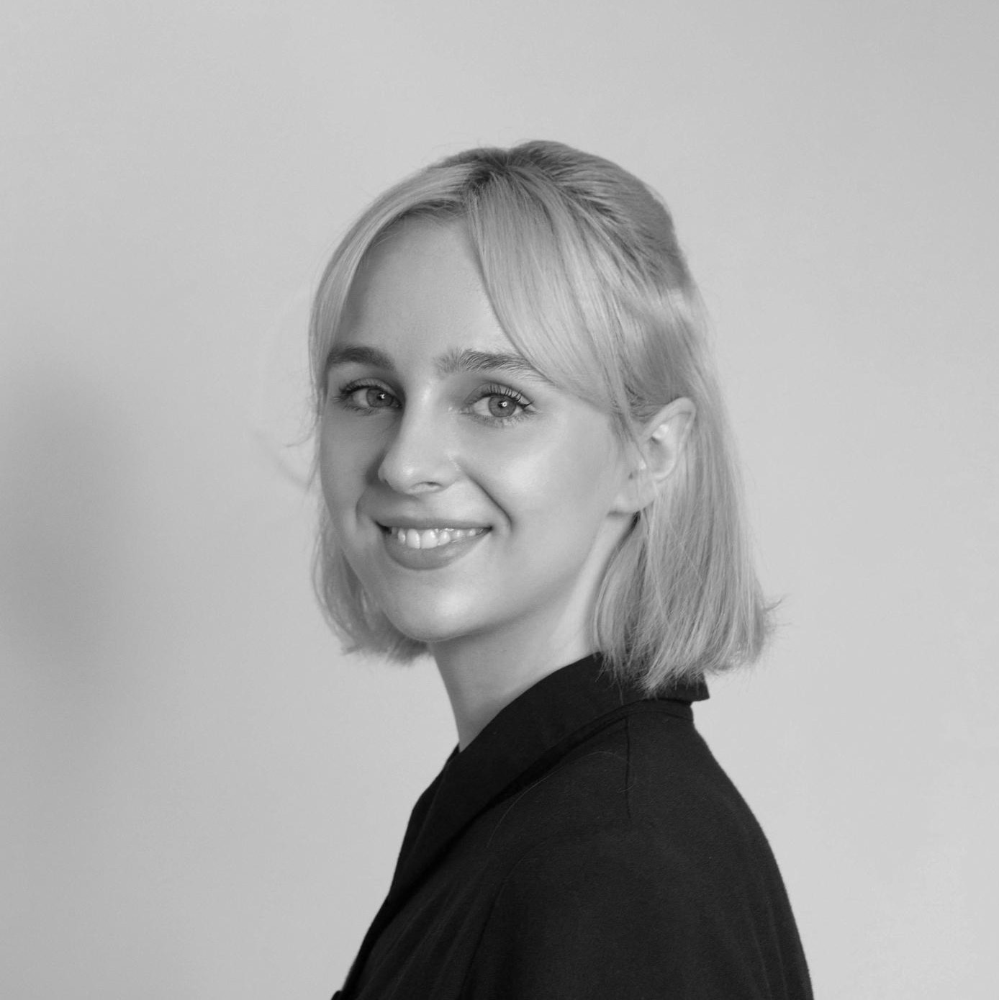

# [a11yphant.com](https://a11yphant.com)

The easy way to learn web accessibility

## Table of Contents

- [About a11yphant](#about-a11yphant)
- [Meet the Team](#meet-the-team)
  - [Concept and Development](#concept-and-development)
  - [Interface and Corporate Design](#interface-and-corporate-design)
- [Contributing to a11yphant](#contributing-to-a11yphant)
  - [Documentation](DOCUMENTATION.md)

## About a11yphant

  a11yphant (pronounced [ˈɛlifənt]) teaches developers the basics of web accessibility. Learn step by step by completing short, interactive coding challenges and quizzes.

In an ideal world, all websites are designed and developed so everyone can use them. Sadly, many websites do not comply with web accessibility guidelines. Therefore, especially people with impairments and disabilities are barred from using them. One of the main problems is that many developers don't know enough about web accessibility. a11yphant wants to improve this situation by giving them a tool for learning accessibility in a fun, interactive way.

  a11yphant is an interactive online course for web accessibility. In this course, you will revisit web
  development topics from an accessibility perspective. For example, how to make sure that assistive technologies like screen readers can
  interact with the website? Or, what is the purpose of the different semantic HTML elements? These are some of the things you will learn by
  writing meaningful markup and completing quizzes.

## Meet the Team

a11yphant started as a master’s project created by six students at the <a href="https://www.fh-salzburg.ac.at/en/" target="_blank" rel="noopener noreferrer nofollow">
Salzburg University of Applied Sciences</a> in Austria. The interdisciplinary team consisted of four web engineering and two communication design students.

Nowadays, the a11yphant core-team continues developing a11yphant as Open Source project. Their goal is to make the web a more accessible and inclusive place.

### Concept and Development

<a href="https://dnikub.dev"  target="_blank" rel="noopener noreferrer nofollow">Daniela Kubesch</a> is a frontend developer who is passionate about accessibility and inclusive design. She strongly believes in equality and inclusion. Daniela is co-founder of a11yphant. When she is not coding, she juggles all things of organisational nature.

<a href="https://lucapircher.at" target="_blank" rel="noopener noreferrer nofollow">Luca Pircher</a> is a web developer based in Austria who firmly believes the web should be inclusive. At a11yphant, Luca supports the team as the "Technical Project Lead" by ensuring that the project is a joy to work on for the dev team and planning the technical requirements for upcoming challenges.

<a href="https://github.com/thomasdax98" target="_blank" rel="noopener noreferrer nofollow">Thomas Dax</a> is a full-stack developer interested in product development and developer experience. As "Head of Text", he has supported the team with copywriting since co-founding a11yphant. Thomas further does a lot of frontend development work and takes care of the development setup.

<a href="https://github.com/hntrhfr" target="_blank" rel="noopener noreferrer nofollow">Michael Hinterhofer</a> is a corporate backend developer on weekdays and chief of happiness officer for a11yphant on the weekend. Since co-founding a11yphant, he supported the team with his magic in the backend.

### Interface and Corporate Design

<a href="https://johannawicht.com" target="_blank" rel="noopener noreferrer nofollow">Johanna Wicht</a> is a communication designer based in Salzburg with a strong interest in visualizing data and identities. She received multiple awards, including ADC Talent and CCA Student of the year.

<a href="https://www.fabianhellerdesign.com" target="_blank" rel="noopener noreferrer nofollow">Fabian Heller</a> is an interdisciplinary digital designer at the intersection of Graphic Design, Motion Design and Illustration. He received multiple awards for his work in these fields.

## Contributing to a11yphant

Looking to contribute something to a11yphant? [**Here's how you can help.**](CONTRIBUTING.md)

## Documentation

Interested in the technology behind a11yphant? Have a look at our [documentation](DOCUMENTATION.md).

© 2022 - 2023, a11yphant.